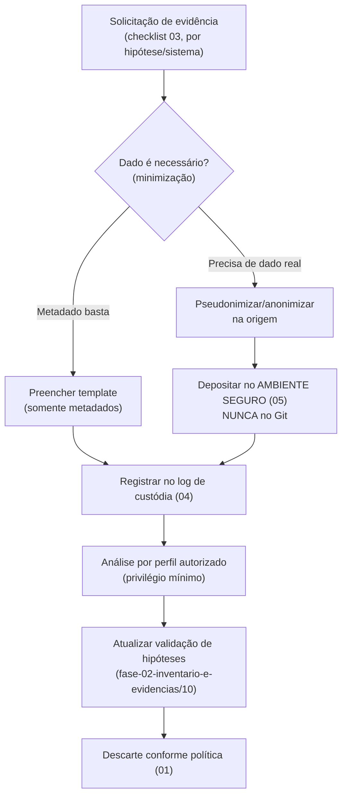

# Ambiente Seguro de Coleta de Evidências — Fase 2 (desbloqueio)

> **Status:** Framework criado (v0.1) · **Data:** 2026-07-14
> **Propósito:** Estabelecer o processo, a governança e as barreiras técnicas para coletar as evidências que faltam à Fase 2 (BL1–BL5) **com segurança, minimização e conformidade LGPD desde a concepção** — sem que dados pessoais reais transitem por locais inseguros (como o Git).

## O que este "ambiente seguro" é (e o que não é)

| É | Não é |
|---|---|
| Um **framework de coleta**: políticas, papéis, templates de **metadados**, registro de custódia e a **especificação** do ambiente técnico a provisionar. | Não é a infraestrutura em si — a provisão (VPC, storage cifrado, IAM) é **ação humana/infra**, especificada em `05`. |
| Barreiras no repositório para que **dados brutos nunca sejam versionados**. | Não é um lugar para depositar dados reais. **Repositório Git ≠ ambiente seguro para dados pessoais.** |
| Um caminho auditável para transformar hipóteses (Fase 1) em fatos (Fase 2). | Não substitui o parecer do Jurídico/DPO nem a autorização de acessos. |

## Princípios (segurança e privacidade desde a concepção)

1. **Minimização:** coletar o **mínimo necessário**. Preferir **schema/metadados** e **amostras fictícias** a dados reais. Quando dado real for indispensável, **pseudonimizar/anonimizar** antes de sair do sistema de origem.
2. **Privilégio mínimo:** cada pessoa acessa só o que precisa; toda concessão é temporária e revogável.
3. **Segregação:** quem fornece a evidência ≠ quem a analisa ≠ quem aprova.
4. **Rastreabilidade:** toda evidência entra pelo **registro de custódia** (`04`) — origem, responsável, data, classificação.
5. **Sem segredos:** credenciais/tokens/chaves nunca são coletados. Para acessar sistemas, usar contas de serviço de leitura, criadas e revogadas pela equipe do sistema.
6. **Cifragem:** dados em trânsito e em repouso cifrados no ambiente provisionado (`05`).
7. **Descarte:** evidências têm prazo; ao fim da análise, são descartadas conforme política (`01`).

## Estrutura do framework

```
docs/fase-02-coleta-segura-de-evidencias/
├── 00-README-ambiente-seguro.md          (este arquivo)
├── 01-politica-de-classificacao-e-minimizacao.md
├── 02-modelo-de-controle-de-acesso.md
├── 03-checklist-de-solicitacao-de-evidencias.md   (o que pedir, por sistema/hipótese)
├── 04-registro-de-evidencias.md          (cadeia de custódia)
├── 05-especificacao-do-ambiente-seguro.md (o que provisionar)
└── templates/                            (somente metadados / amostras fictícias)
    ├── template-inventario-sistema.csv
    ├── template-fonte-de-dados.csv
    ├── template-integracao.csv
    ├── template-dicionario-de-dados.csv
    └── template-ropa.csv

_evidencias-brutas/                        (barreira: ignorada pelo Git)
└── README.md
```

## Fluxo de coleta (resumido)



## Como isto desbloqueia a Fase 2

| Bloqueio (Fase 2) | Como o framework endereça |
|-------------------|---------------------------|
| BL1 — legado ausente | `03` lista exatamente o que pedir; `templates/` captura como metadados. |
| BL2 — schema Supabase não lido | `03` + `05` definem coleta de metadados via conta de leitura / export; requer **autorização** (não simulada). |
| BL3 — sem docs LGPD/segurança | `03` solicita ROPA, DPA, políticas; `template-ropa.csv` padroniza. |
| BL4 — sem baseline | `template-inventario-sistema.csv` tem coluna de volume estimado. |
| BL5 — definições ambíguas | `template-dicionario-de-dados.csv` força definição por entidade/campo. |

## Limites honestos (o que ainda depende de terceiros)
- **Provisão do ambiente técnico (`05`)**: requer infra/decisão humana.
- **Autorização do Supabase**: leitura do schema exige autorizar o conector (sessão interativa) — **não** foi simulada.
- **Parecer jurídico**: transferência internacional, retenção ICP-Brasil × exclusão LGPD, papel de operador — decisão do Jurídico/DPO.

> Nenhum dado foi inventado. Os templates estão **vazios** (apenas cabeçalhos) e as amostras são **explicitamente fictícias**.
