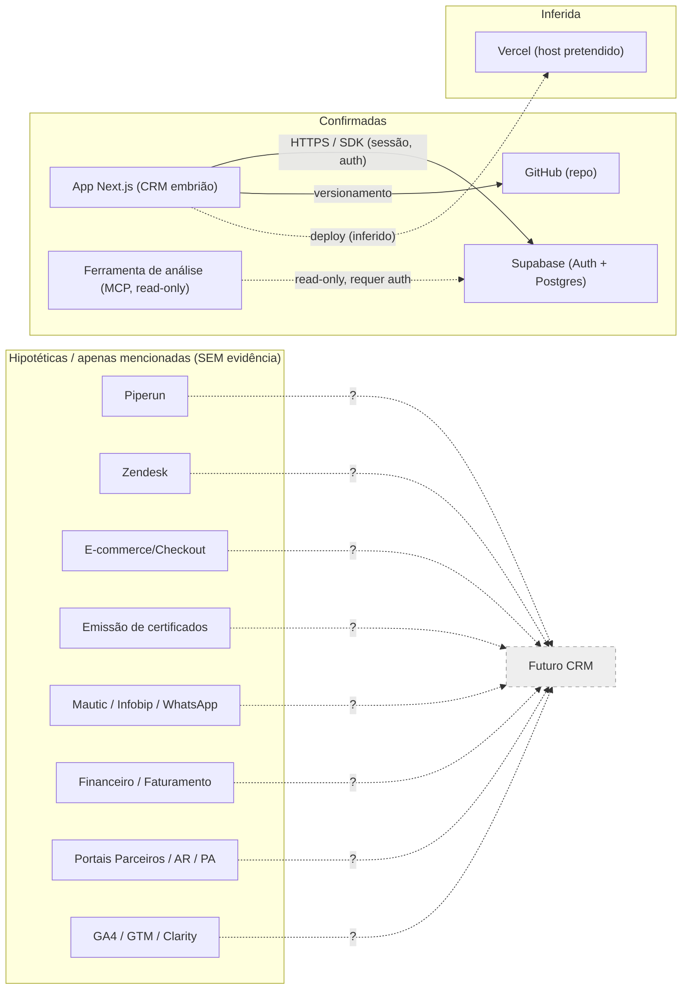

# 06 — Integrações e Linhagem

> **Data:** 2026-07-14 · Só se registram integrações **encontradas ou mencionadas**. Nada é afirmado sem evidência (regra 10). O diagrama diferencia confirmadas × mencionadas × hipotéticas.

## Integrações COM evidência no ambiente

### INT1 — App Next.js ⇄ Supabase (Auth + DB)
| Campo | Valor | Classificação |
|-------|-------|---------------|
| Origem → Destino | App Next.js → Supabase | Fato |
| Objetivo | Autenticação de sessão e (futura) persistência | Fato (auth) / Inferência (DB) |
| Dados transmitidos | Credenciais de sessão/cookies; (dados de negócio: ainda nenhum) | Fato |
| Direção | Bidirecional (SDK) | Fato |
| Frequência | Por requisição (refresh de sessão no proxy) | Fato |
| Tecnologia/Protocolo | HTTPS via `@supabase/ssr` / `supabase-js` | Fato |
| Autenticação | Chave **publishable** (`NEXT_PUBLIC_*`) + sessão por cookie | Fato |
| Criptografia | TLS (Supabase) | Inferência (padrão do produto) |
| Tratamento de erros/Retentativas/Idempotência | Não implementado no app (scaffold) | Fato/ND |
| Logs/Monitoramento | Nenhum no app | Fato |
| Responsável | ND | Informação ausente |
| Risco | Segurança depende de RLS (R-SEC-02) | Risco |
| Status | **Confirmada** | — |

### INT2 — Ferramenta de análise (MCP) ⇄ Supabase
| Campo | Valor | Classificação |
|-------|-------|---------------|
| Origem → Destino | Cliente MCP → Supabase (`mcp.supabase.com`) | Fato (`.mcp.json`) |
| Objetivo | Acesso **somente-leitura** ao projeto para análise | Fato |
| Autenticação | Requer autorização (OAuth) — **indisponível nesta sessão** | Fato |
| Status | **Confirmada (configurada)**, porém não utilizável sem auth | Evidência parcial |

## Integrações apenas MENCIONADAS (enunciado) ou HIPOTÉTICAS
> Todas as conexões entre sistemas de negócio (Piperun↔CRM, e-commerce↔emissão, Infobip/WhatsApp↔atendimento, Mautic↔base, financeiro↔faturamento, GA4/GTM↔web, etc.) **não têm nenhuma evidência**. Status: **Hipotética / Apenas mencionada**. Não são desenhadas como reais.

| Integração hipotética | Status |
|-----------------------|--------|
| Emissão de certificados ⇄ Cadastro comercial | Hipotética |
| E-commerce/Checkout ⇄ Financeiro | Hipotética |
| Marketing (Mautic/Infobip) ⇄ Base de contatos | Hipotética |
| Atendimento (Zendesk/WhatsApp) ⇄ Cliente | Hipotética |
| Portais de parceiros/AR ⇄ Núcleo | Hipotética |
| Analytics (GA4/GTM/Clarity) ⇄ Web/CRM | Hipotética |

## Mapa de integrações (Mermaid)

> **Legenda:** linha cheia = **confirmada** (evidência no repo); linha pontilhada para Vercel = **inferida**; bloco "Hipotéticas" com `?` = **apenas mencionadas, sem evidência**. As integrações hipotéticas convergem para um "Futuro CRM" **conceitual** — não existem hoje.

## Linhagem de dados (preliminar)

| Dado crítico | Coleta | Armazenamento | Consumo | Exclusão | Histórico | Status da linhagem |
|--------------|--------|---------------|---------|----------|-----------|--------------------|
| Sessão/autenticação | Login (Supabase Auth) | Supabase | App (cookies) | Logout/expiração | ND | **Parcial** (confirmada só no app) |
| Dados de identificação (PF/PJ) | ND | ND (Supabase futuro) | ND | ND | ND | **Incompleta** |
| Certificados | ND (emissão) | ND | ND | ND (retenção ICP-Brasil) | ND | **Incompleta** |
| Dados comerciais | ND | ND | ND | ND | ND | **Incompleta** |
| Atendimento | ND | ND | ND | ND | ND | **Incompleta** |
| Financeiro | ND | ND | ND | ND | ND | **Incompleta** |
| Consentimentos | ND | ND | ND | ND (revogação) | ND | **Incompleta** |

> **Conclusão (regra 12):** exceto pela sessão de autenticação, **toda a linhagem é incompleta** por ausência de evidência. Não foi inventado nenhum fluxo.

## Lacunas
- Contratos de API, especificações, direção/frequência reais das integrações de negócio: **ND**.
- Tratamento de erros, idempotência, monitoramento: **não implementados/ND**.
- Confirmação de deploy na Vercel: **ND**.
